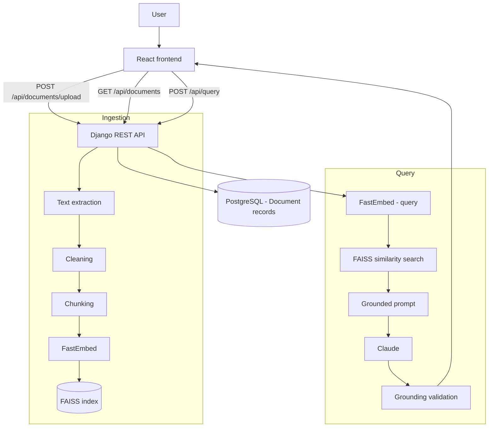

# Enterprise Knowledge Assistant

A retrieval-augmented generation (RAG) platform: upload a document, ask a
question about it, and get an answer grounded in — and cited from — the
document's actual content. Django REST Framework backend, PostgreSQL,
FastEmbed embeddings, a local FAISS vector index, Claude for generation, and
a React/Vite frontend.

This is a demonstrable MVP, not a production system — see
[Current Limitations](#current-limitations) before assuming otherwise.

## Architecture Overview



See [docs/architecture](./docs/architecture) for the full request-by-request
walkthrough of both flows, and [docs/decisions](./docs/decisions) for why
each technology was chosen.

## Key Features

- Document upload with real-time ingestion status (ready / failed, with an
  error message when extraction fails)
- Full ingestion pipeline: text extraction → cleaning → fixed-size chunking
  with overlap → FastEmbed embeddings → FAISS indexing, all in one request
- Grounded question answering: retrieval-first architecture (the LLM never
  answers without retrieved context first), structured JSON output enforced
  by the Anthropic API's schema mode, and independent server-side
  verification that every cited source was actually retrieved
- Clean failure handling throughout: unsupported file types, empty
  documents, and LLM/provider failures all return clear, typed responses —
  never a raw stack trace
- 49 automated tests covering chunking, extraction, embedding + FAISS
  retrieval (with the real model), grounding validation, and the full API
  surface

## Technology Stack

| Layer | Technology |
|---|---|
| Backend | Django 6, Django REST Framework |
| Database | PostgreSQL |
| Embeddings | FastEmbed (`BAAI/bge-small-en-v1.5`, local, no API key) |
| Vector index | FAISS (`faiss-cpu`), local, file-persisted |
| LLM | Anthropic Claude, behind a swappable `LLMProvider` interface |
| Frontend | React 19, Vite |
| Dependency management | Poetry (backend), npm (frontend) |

## Setup

### Prerequisites

- Python 3.12+, [Poetry](https://python-poetry.org/)
- Node.js 18+, npm
- PostgreSQL 16 (or `docker compose up -d` using the provided
  `docker-compose.yml`, which reads the same `DB_*` variables from `.env`)
- An [Anthropic API key](https://console.anthropic.com/) with usable
  credits, to exercise `/api/query` end to end (see
  [Current Limitations](#current-limitations))

### Backend

```bash
poetry install
cp .env.example .env      # fill in DJANGO_SECRET_KEY, DB_*, ANTHROPIC_API_KEY
docker compose up -d      # or point DB_* at an existing Postgres instance
poetry run python manage.py migrate
poetry run python manage.py runserver
```

Run the test suite:

```bash
poetry run python manage.py test rag
```

### Frontend

```bash
cd frontend
npm install
cp .env.example .env      # VITE_API_BASE_URL, defaults to http://localhost:8000
npm run dev
```

### Environment Variables

**Backend (`.env`, see `.env.example`):**

| Variable | Purpose |
|---|---|
| `DJANGO_SECRET_KEY` | required, no default |
| `DJANGO_DEBUG` | `True` for local dev |
| `DJANGO_ALLOWED_HOSTS` | comma-separated |
| `CORS_ALLOWED_ORIGINS` | comma-separated; scoped to the frontend's origin, not a wildcard |
| `DB_NAME`, `DB_USER`, `DB_PASSWORD`, `DB_HOST`, `DB_PORT` | PostgreSQL connection |
| `ANTHROPIC_API_KEY` | required for `/api/query` to succeed; the rest of the pipeline works without it |
| `ANTHROPIC_MODEL` | optional, defaults to `claude-opus-5` |
| `RAG_EMBEDDING_MODEL` | optional, defaults to `BAAI/bge-small-en-v1.5` |
| `RAG_CHUNK_SIZE`, `RAG_CHUNK_OVERLAP` | optional, default `500` / `50` |
| `RAG_TOP_K` | optional, default `5` |
| `RAG_VECTOR_STORE_DIR` | optional, defaults to `./data/vector_store` |

**Frontend (`frontend/.env`, see `frontend/.env.example`):**

| Variable | Purpose |
|---|---|
| `VITE_API_BASE_URL` | backend origin, no trailing slash |

## Document Ingestion Flow

Upload → text extraction (`.txt` only today, see
[ADR-0006](./docs/decisions/0006-single-document-format.md)) → whitespace
cleaning → fixed-size chunking with overlap → FastEmbed embedding of every
chunk → FAISS indexing → a `Document` row recording filename, char/chunk
counts, and status. An empty or unextractable document is recorded as
`status=failed` with an explanatory error message — not a server error. Full
detail: [docs/architecture/data-flow.md](./docs/architecture/data-flow.md).

## Query Flow

Question → embed with the same FastEmbed model used for documents → FAISS
similarity search for the top-k chunks → those chunks (tagged with their
source and chunk ID) are placed in a grounded prompt instructing Claude to
answer only from them → Claude returns structured JSON (answer + cited
sources) → the backend independently verifies every cited chunk ID against
what was actually retrieved, dropping anything unverifiable, before
returning the answer to the frontend. Full detail:
[docs/architecture/data-flow.md](./docs/architecture/data-flow.md) and
[docs/prompt-engineering.md](./docs/prompt-engineering.md).

## Current Limitations

- **Only `.txt` files are supported.** The extraction layer is built to
  extend (one class + a registry entry per format), but PDF/DOCX aren't
  implemented.
- **No live-LLM verification in this environment.** During this project's
  most recent pass, the configured Anthropic API key had no usable credits.
  Retrieval (embedding + FAISS search) is verified working end-to-end with
  the real model. The LLM call's *failure* handling is verified against the
  real API (a real exhausted-credits error was reproduced and confirmed to
  map to a clean `502`, not a raw exception). The LLM call's *success* path
  is verified only via a mocked provider that exercises the same
  parsing/grounding-validation code a real response would — this is not the
  same as confirming real answer quality end to end.
- **Single-process FAISS index**, not shared across multiple app server
  instances, and not transactionally consistent with the PostgreSQL
  `Document` table (two separate stores, no shared transaction). See
  [ADR-0004](./docs/decisions/0004-faiss-vector-store.md).
- **No authentication, multi-tenancy, or rate limiting.** Anyone who can
  reach the API can upload and query all documents.
- **Ingestion is synchronous** — a large document's embedding step holds
  the HTTP request open for its full duration; there is no background job
  queue.
- **No document delete endpoint.**

None of the above is a hidden gap — see [docs/ROADMAP.md](./docs/ROADMAP.md)
for what each one would take to fix, and [docs/decisions](./docs/decisions)
for why the current state was a reasonable place to stop for this MVP.

## Documentation

- [docs/architecture](./docs/architecture) — system overview, request flows, deployment reality
- [docs/decisions](./docs/decisions) — ADRs for the major technology/design choices
- [docs/learning](./docs/learning) — deep dives on chunking, embeddings, and vector search
- [docs/prompt-engineering.md](./docs/prompt-engineering.md) — the grounded-prompt design and hallucination-mitigation strategy
- [docs/interview](./docs/interview) — interview-prep Q&A specific to this implementation
- [CHANGELOG.md](./CHANGELOG.md) — what changed and why
